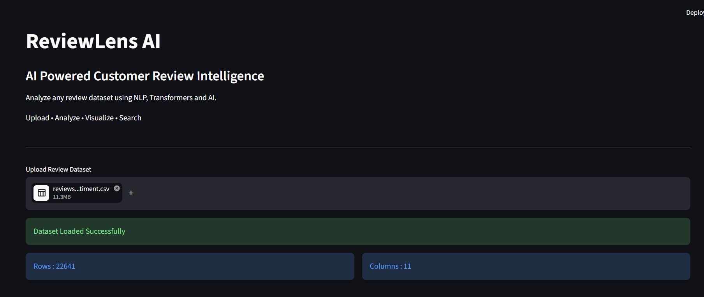
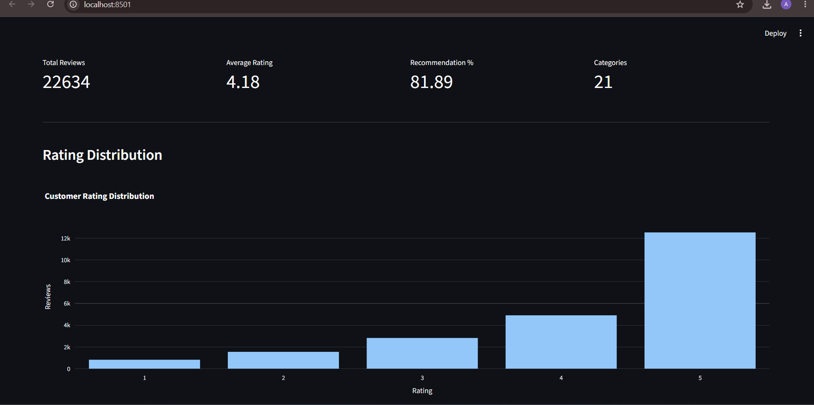
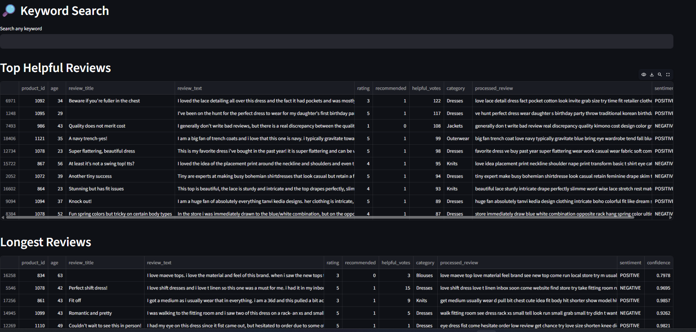
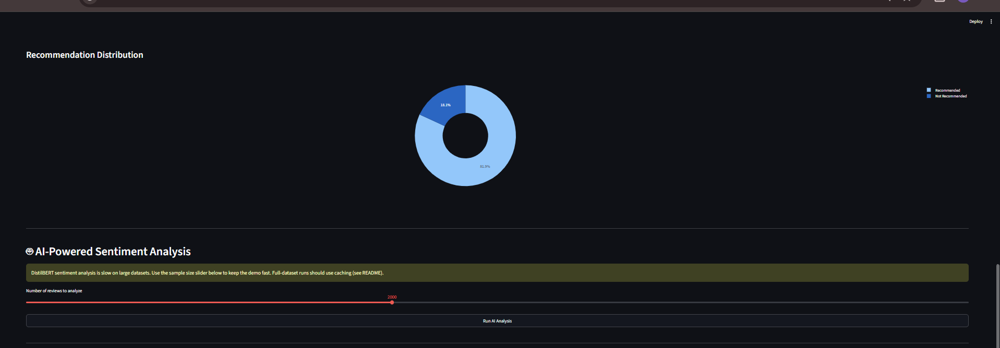

# ReviewLens AI

AI-powered customer review analytics platform built using Python and Streamlit.

## Demo



## Features

- Upload any review dataset (CSV)
- Automatic column detection
- Manual column mapping
- Interactive dashboard
- Rating distribution
- Category-wise analysis
- Customer age analysis
- Search reviews
- Download processed dataset

## Screenshots

**Rating Distribution & Dataset Overview**


**Keyword Search**


**Recommendation Breakdown**


## Tech Stack

- Python
- Streamlit
- Pandas
- Plotly
- spaCy
- Transformers
- Sentence Transformers
- FAISS

## Setup & Run

```bash
git clone https://github.com/anshika02-07/reviewlens-ai.git
cd reviewlens-ai
pip install -r requirements.txt
streamlit run app.py
```

## Future Enhancements

- Semantic Search
- RAG Chatbot
- LLM-based Review Assistant
